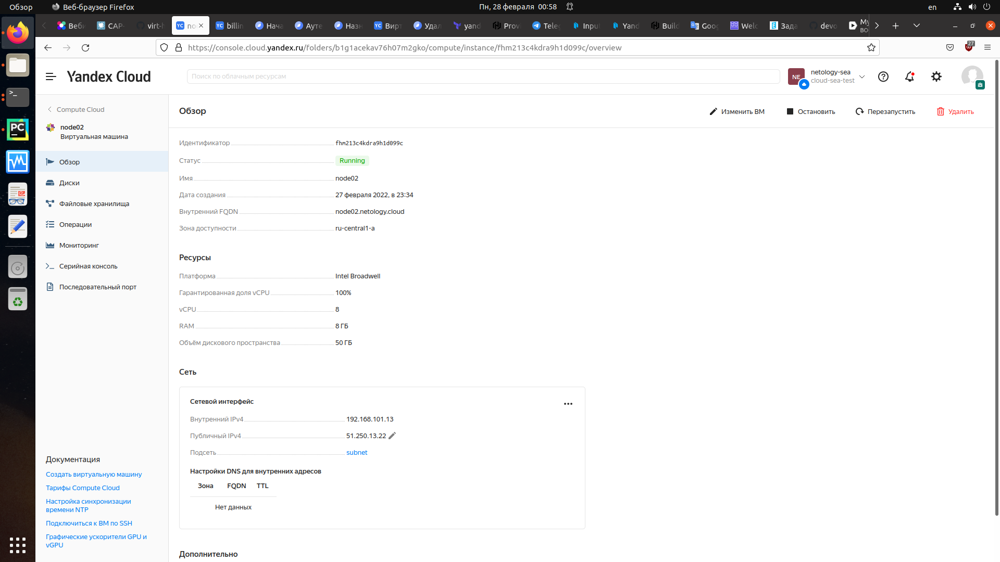

## Задача 1

Создать собственный образ операционной системы с помощью Packer.

Для получения зачета, вам необходимо предоставить:
- Скриншот страницы, как на слайде из презентации (слайд 37).


### Решение:

- Подготовительные шаги:
  * Установка утилиты `yc`
  ```commandline
  curl https://storage.yandexcloud.net/yandexcloud-yc/install.sh | bash
  ```
  * Инициализация в `yandex cloud`
  ```
  yc init
  ``` 
  * Проверка созданной конфигурации:
  ```
  yc config list
  ```
  * Получить информацию о текущих параметрах профиля
  ```
  yc config profile list
  ```
  * Получить подробную информацию о профиле
  ```
  yc config profile get netology-sea
  ```
  * Инициализация сети 
  ```
  yc vpc network create --name net --labels my-label=netology-sea \
  --description "my first network via yc"
  ```
  * Создание подсети
  ```
  yc vpc subnet create --name my-subnet-a --zone ru-central1-a --range 10.1.2.0/24 \
  --network-name net --description "my first subnet via yc"
  ```
  * Просмотр конфигурации сети
  ```
   yc vpc network list
  ```
    * Просмотр конфигурации сети в YAML формате
  ```
   yc vpc network list --format yaml
  ```
  * Просмотр подсетей
  ```
   yc vpc network list-subnets net
  ```
---

  * Установка `packer`
  ```
  curl -fsSL https://apt.releases.hashicorp.com/gpg | sudo apt-key add - && \
  sudo apt-add-repository "deb [arch=amd64] https://apt.releases.hashicorp.com $(lsb_release -cs) main" && \
  sudo apt-get update && sudo apt-get install packer
  ```
  * Сборка образа
  ```
  packer build centos-7-base.json
  ``` 
  * Преобразование файла конфигурации из `json` в `pkr.hcl`. Команда hcl2_upgrade автоматически сопоставляет и генерирует соответствующий блок HCL2.
  Требуется переименовать эти блоки, чтобы точно представить и описать ресурс. Например `"yandex" "autogenerated_1"` в `"yandex" "centos7"`. 
  ```
  packer hcl2_upgrade -with-annotations centos-7-base.json
  ```
  * Просмотр доступных образов
  ```
  yc compute image list
  ```
  * Удаление образа
  ```
  yc compute image delete --name centos-7-base
  ```
  * Удаление сети и подсети
  ```
  yc vpc subnet delete my-subnet-a && yc vpc network delete net
  ```
  * Переключение на профиль `default` и удаление профиля `netology-sea`
 ```
  yc config profile activate default && yc config profile delete netology-sea
 ```
 * Получить список каталогов
 ```
  yc resource-manager folder list
 ```
 * Удалить каталог
 ```
   yc resource-manager folder delete netology-sea
 ```
 #### Результат - создан образ
 ---
 <p align="center"> 
  
</p>

 ---
 <p align="center"> 
  
</p> 

## Задача 2

Создать вашу первую виртуальную машину в Яндекс.Облаке.

Для получения зачета, вам необходимо предоставить:
- Скриншот страницы свойств созданной ВМ, как на примере ниже:

<p align="center"> 
  
</p>


### Решение:

 * Установка `terraform`
  ```commandline
  curl -fsSL https://apt.releases.hashicorp.com/gpg | sudo apt-key add - && \
  sudo apt-add-repository "deb [arch=amd64] https://apt.releases.hashicorp.com $(lsb_release -cs) main" && \
  sudo apt-get update && sudo apt-get install terraform
  ```
 * Предварительно, в консоле управления YandexCloud или cредствами CLI создаём сервисный аккаунт `service-acc1`

 * Если сервисный аккаунт создан средствами CLI - требуется присвоить ему роль

 * Создание авторизованного ключа для сервисного аккаунта и запись в файл `key.json`
 ```
 yc iam key create --service-account-name service-acc1 --output key.json
 ```
 * Создание профиля, который будет использоваться для выполнения операций от имени сервисного аккаунта `service-acc1`
 ```
 yc config profile create service-acc1-profile
 ```
 * Добавление в конфигурацию профиля авторизованного ключа сервисного аккаунта `service-acc1`
 ```
 yc config set service-account-key key.json
 ```
 * Указание в конфигурации профиля облака
 ```
 yc config set cloud-id b1g32bnnvq7h1beo0pne
 ```
 * Указание в конфигурации профиля папки
 ```
 yc config set folder-id b1g1acekav76h07m2gko
 ```
 * Посмотреть список каталогов, доступных этому аккаунту:
 ```
 yc resource-manager folder list
 ```
---

 * Инициализация конфигурации terraform (проходит по всем *.tf и в зависимости от провайдера скачивает бинарник)
 ```
 terraform init
 ```
* Предварительный просмотр того, что будет создано в облачной инфраструктуре
 ```
 terraform plan
 ```
* Внесение изменений в облачную инфраструктуру
 ```
 terraform apply
 ```
* Удаление ранее внесенных изменений
 ```
 terraform destroy
 ```
#### Результат - создано две ВМ: node01 с внешним IP 51.250.11.126 и node02 с внешним IP 51.250.13.22


<p align="center"> 
  
</p>

<p align="center"> 
  
</p>

<p align="center"> 
  
</p>


## Задача 3

Создать ваш первый готовый к боевой эксплуатации компонент мониторинга, состоящий из стека микросервисов.

Для получения зачета, вам необходимо предоставить:
- Скриншот работающего веб-интерфейса Grafana с текущими метриками, как на примере ниже
<p align="center"> 
 
</p>


### Решение:

 * Применение плейбука для node1
 ```
 ansible-playbook provision.yml 
 ```

#### Результат - скриншот с Grafana (node01 IP 51.250.11.126):

<p align="center"> 
 
</p>

## Задача 4 (*)

Создать вторую ВМ и подключить её к мониторингу развёрнутому на первом сервере.

Для получения зачета, вам необходимо предоставить:
- Скриншот из Grafana, на котором будут отображаться метрики добавленного вами сервера.


### Решение:

 * Применение плейбука для node2
 ```
 ansible-playbook provision_monitoring_node.yml 
 ```
#### Результат - `nodeexporter_node2`, `cadvisor_node2` (node02 IP 51.250.13.22) на скриншотах с Grafana и Prometheus (node01 IP 51.250.11.126):

<p align="center"> 
 
</p>

<p align="center"> 
 
</p>

--- 
##### P.S. После выполнения задания удален сервисный аккаунт `service-acc1`. Наличие в конфигах связанной с ним ключевой информации - не критично

